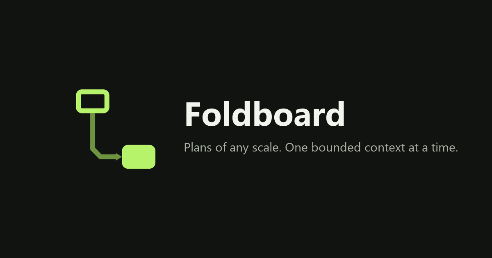

# Foldboard

Foldboard is a browser UX for people and AI agents to edit plans together over
[WebMCP](https://webmachinelearning.github.io/webmcp/). Plans scale through
**folds**: nested levels that keep the visible and agent-readable context
bounded to the area being worked on.



The behaviour reference is [docs/board.md](docs/board.md); the agent contract is
[docs/webmcp.md](docs/webmcp.md).

## What it is

Foldboard has four primitives:

- **Block** — one part of the plan: a name and one description.
- **Fold** — a card with its own inner level. Only the current level is on
  screen; a fold's contents live one step down.
- **Arrow** — a connection between two blocks or folds. No ports, no contracts.
  An arrow may not connect a card to a fold that contains it.
- **External card** — how a connection that crosses a fold boundary appears
  inside it. It opens the original instead of duplicating it.

Search, automatic layout, an unbounded canvas, undo and agent requests support
these primitives.

## Bounded context

- A person enters a fold and sees only the level needed for the task at hand.
- An agent starts with a compact outline, then requests a specific area with a
  depth limit, pagination and a token budget.
- Reads do not navigate the person's interface. Navigation and selection are
  explicit actions.
- Writes can be validated before they are applied and are guarded by the board
  revision, so stale context cannot silently overwrite newer human work.

## Overview

The map is a read-only, flattened view of the board. It shows every block on one
canvas, omits folds and replaces paths through them with direct arrows. It never
changes board data.

## Trace

**Trace** turns one path across nested levels into a line without changing the
board.

- Steps follow arrow order; external cards resolve to their originals.
- Crossed folds appear as collapsible bands above the path.
- The longest continuation is shown first; alternatives remain available as
  branches.
- Boundary-crossing arrows are marked.
- `Read` shows the path as full text; `Copy as Markdown` copies it.

Select a card and press `T`. Two selected cards trace the segment between them;
no selection traces the longest chain. Either endpoint can be pinned to any
card on the board, including a card in another fold. Using the same card at both
ends traces its loop once. `Enter` opens a step at its source level and `Esc`
returns to the previous level and camera.

Trace only reads the structure. Names and descriptions remain editable in
`Read`, but arrow order does not change there.

## Run it

```bash
flutter pub get
flutter run -d web-server --release --web-hostname 127.0.0.1 --web-port 4174
```

Then open `http://localhost:4174`.

Always use the same address. Boards are stored in the browser under that
origin: a different port, a different browser, or clearing site data does not
carry them over.

## Storage

There is no backend. Boards, settings and agent requests live in browser local
storage:

- Boards autosave. A failed write raises a visible warning instead of silently
  dropping edits.
- One tab owns write access (via Web Locks). A second tab opens read-only
  rather than overwriting the first.
- Undo keeps the last 100 actions per project, until the tab reloads.
- **Export is the only backup.** Clearing site data removes everything.

## Export

`Export project` in the header offers four formats:

| Format | Contains | Use for |
| --- | --- | --- |
| JSON | the exact board, re-importable | backup, moving between browsers |
| PNG | the current level as laid out | pasting a diagram into a doc or issue |
| Mermaid | a `flowchart` with folds as nested subgraphs | GitHub, Notion, any Markdown renderer |
| Markdown | a coordinate-free plan document | reading, review, feeding an agent |

Exports do not include agent requests or replies.

## Agents

Foldboard registers 18 tools on `document.modelContext`. The visual interface
also works without a WebMCP client.

Agents start with a compact outline and read focused context with `get-area`
(paginated, depth-limited and token-budgeted). They validate proposals with
`apply-changes(validate: true)` and write with `apply-changes` guarded by
`expectedRevision`. People leave requests on cards or arrows; agents read them
with `list-requests` and close them with `resolve-request`. Saving a request
does not start an agent.

`Settings → Agent access` set to view only blocks WebMCP writes locally. It
restricts the API, not browser UI automation.

The full tool catalogue, error codes and paging rules are in
[docs/webmcp.md](docs/webmcp.md).

## Keyboard

`?` on the board opens the full reference. The essentials:

| Keys | Action |
| --- | --- |
| `Ctrl/⌘ F` | search every level |
| `T` | trace the thread through the selection |
| `←`, `→`, `Enter` | in a trace: walk it, open a step where it lives |
| `[`, `]`, `1`, `2` | in a trace: another branch, Cards or Read |
| `Ctrl/⌘ Z`, `Ctrl/⌘ Shift Z` | undo, redo |
| `Ctrl/⌘ D` / `Ctrl/⌘ C` / `Ctrl/⌘ V` | duplicate, copy, paste a card |
| two-finger scroll, `Space` + drag, middle mouse | pan |
| pinch, `Ctrl/⌘` + wheel | zoom |
| `Tab`, `Enter`, arrows | focus a card, open it, move it |

## Development

```bash
dart analyze
flutter test
flutter build web --release --no-web-resources-cdn
```

`--no-web-resources-cdn` is not optional. Without it Flutter loads CanvasKit from
`www.gstatic.com` and its fallback font from `fonts.gstatic.com`, so the app
stops working offline, behind a strict CSP, or on a restricted network.

- Interface strings live in `lib/l10n/app_en.arb`; run `flutter gen-l10n` after
  editing. Never edit `lib/l10n/generated`.
- Colours, radii and type live in `lib/ui/core/app_theme.dart`. Feature widgets
  read `context.colors` and `context.type` and add no colour literals.
- Icons and the social preview are generated: `python tool/make_icons.py`.
- Type is Inter, subset to Latin + Cyrillic and bundled in `assets/fonts`
  (`python tool/subset_inter.py Inter-4.1.zip` rebuilds it). CanvasKit cannot use
  system fonts, so an unbundled family silently renders as downloaded Roboto.
  Only 400/600/700 are shipped; asking for another weight synthesises it.
- `AppInfo.appVersion` mirrors `pubspec.yaml`; `test/app_info_test.dart` fails
  if they drift.
- Storage keys and the Web Lock name are defined once in
  `lib/storage_keys.dart`. Browser APIs live in a conditional Dart service;
  the page has no custom JavaScript bridge. There are no format versions
  or migrations: the app reads one document shape and one key prefix.

## Before you deploy

- A release build makes **no third-party requests**: CanvasKit, fonts and icons
  are all served from your own origin. Keep it that way — verify with the
  network panel after changing the build command.
- `web/index.html` sets `og:image` to a relative path. Point it at an absolute
  URL once the app has a domain, or link previews will not render.
- Serve `build/web` from the origin users will keep. Moving the app to a new
  origin leaves their boards behind.

## License

[MIT](LICENSE).
